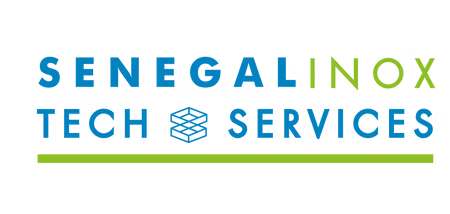

# 🇸🇳 Sénégal Inox Tech & Services

<div align="center">



**Plateforme industrielle nouvelle génération de Sénégal Inox SARL**  
*Chaudronnerie lourde • Tuyauterie industrielle • Charpente métallique • Réparation navale • Décoration haut standing*

[](https://nextjs.org/)
[](https://react.dev/)
[](https://www.typescriptlang.org/)
[](https://tailwindcss.com/)
[](https://vercel.com/)
[](#)

</div>

---

## 🌟 La Refonte Digitale (2026)

Ce projet représente la **refonte numérique complète et sur-mesure** de la vitrine officielle de **Sénégal Inox SARL**, acteur de référence de la métallurgie et du soudage de haute précision à Dakar depuis plus de 20 ans.

L'objectif de cette refonte est d'aligner l'image digitale de l'entreprise sur ses standards industriels réels : rigueur, modernité, excellence technique et réactivité B2B.

### 🔄 Ce qui a changé :

| Domaine | Ancienne Version | Nouvelle Refonte Digitale ✨ |
| :--- | :--- | :--- |
| **Technologie** | Plateforme générique lente | **Next.js 16 (Turbopack) & React 19** ultra-performant |
| **Design & UI** | Pages statiques basiques | **Identité industrielle haut standing**, typographie soignée aux couleurs officielles (`#0082C1` bleu marine & `#8DBF21` vert précision) |
| **Performance** | Images lourdes non compressées (136 Mo) | **Assets optimisés web (-77%)**, temps de chargement éclair (< 1.2s) |
| **Expérience Mobile** | Affichage mobile standard non hiérarchisé | **Mobile-First chirurgical**, parcours de lecture fluide (texte explicatif en priorité, puis visuels animés) |
| **Section QHSE** | Cartes rectangulaires fermées | **Architecture ouverte d'ingénierie**, colonnes aérées délimitées par séparateurs laser métalliques |
| **Implantation Dakar** | Mention texte isolée | **Console interactive dual-location** avec carte OpenStreetMap sandboxée et guidage direct **Google Maps & Waze** |
| **Savoir-faire & Équipe** | Informations dispersées | **Pages dédiées enrichies** : galerie de réalisations par pôle, certifications soudeurs (DMOS/QMOS) et références historiques |

---

## 🏭 Les 5 Pôles d'Expertise Présentés

1. **Chaudronnerie Lourde & Cuves Industrielles** : Cuves sous pression, réservoirs hydrocarbures, silos et granulateurs certifiés.
2. **Tuyauterie Industrielle Inox & Acier** : Lignes de process agroalimentaire, chimique et pharmaceutique en Inox 304L/316L.
3. **Charpente Métallique & Hangars** : Structures porteuses industrielles, entrepôts grande portée et passerelles techniques.
4. **Construction & Réparation Navale** : Travaux sous agrément naval au Port Autonome de Dakar, coques et apparaux maritimes.
5. **Décoration Haut Standing & Mobilier d'Art** : Garde-corps inox poli miroir, enseignes d'hôtellerie de luxe et métallerie d'art.

---

## 🛠️ Stack Technique

- **Framework** : Next.js 16.3.4 (App Router, Turbopack, Prerendering SSG)
- **Langage** : TypeScript 5 (Strict mode, 0 erreur de typage)
- **Styling** : Tailwind CSS v4 (Design tokens métallurgiques & mode sombre contrasté)
- **Animations** : Framer Motion (Transitions d'ingénierie soyeuses, parallaxe fluide)
- **Iconographie** : Lucide React (Icônes vectorielles légères et sémantiques)
- **Sécurité** :
  - En-têtes HTTP stricts (`HSTS`, `X-Frame-Options`, `X-Content-Type-Options`, `Referrer-Policy`)
  - Iframe sandboxée pour la cartographie
  - Formulaire de contact avec protection anti-bot invisible (*honeypot*)
- **Compression d'images** : Moteur `sharp` avec encodage `mozjpeg` progressif et compression PNG haute densité

---

## 🚀 Démarrage en Local

### 1. Cloner le projet
```bash
git clone https://github.com/HYPNOTYZEDCHART/senegalinox.git
cd senegalinox
```

### 2. Installer les dépendances
```bash
npm install
```

### 3. Lancer le serveur de développement
```bash
npm run dev
```
Ouvrez votre navigateur sur [http://localhost:3000](http://localhost:3000).

### 4. Compiler pour la production
```bash
npm run build
```
Toutes les pages statiques (13/13) sont générées en moins de 2 secondes.

---

## ☁️ Déploiement Vercel (1 Clic)

Ce projet est 100% optimisé pour un déploiement continu sur **Vercel** :

1. Connectez-vous sur [vercel.com/new](https://vercel.com/new) avec votre compte GitHub.
2. Importez le dépôt **`senegalinox`**.
3. Cliquez sur **Deploy** (aucune variable d'environnement obligatoire requise pour le build statique).

---

## 📍 Localisation des Sites à Dakar

- **Siège Administratif & Bureau d'Études** : Route des Puits, Bel-Air, Dakar (Code Plus : `FRXV+22 Dakar`)
- **Atelier Chaudronnerie & Usinage Lourd** : Angle Rue 37 x Boulevard Félix Éboué, Colobane, Dakar (Code Plus : `MRXW+4X Dakar`)

---

## 🤝 Crédits & Conception

Refonte conçue et développée avec passion par **[creativ_tech](https://creativtechsn.vercel.app/)** pour le compte de **Sénégal Inox SARL**.

*Tous droits réservés © 2026 Sénégal Inox SARL.*
